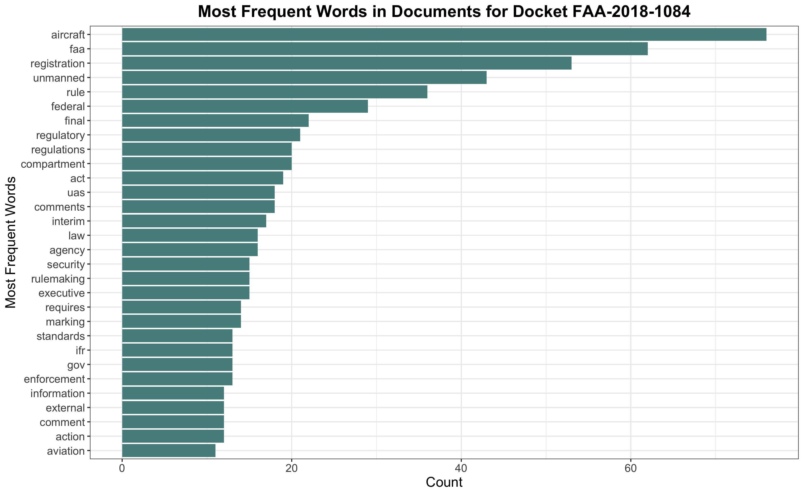

```{r, include = FALSE}
knitr::opts_chunk$set(
  collapse = TRUE,
  comment = "#>"
)
```

## Introduction

In this vignette, we demonstrate a potential use of the `regulationsgov` package. First, using functionality from this package, we obtain all comments and documents associated with a specific docket, including the text of any attachments. Then, we explore how the `tidytext` and `widyr` packages enable us to explore these texts.

```{r setup, message = FALSE}
library(regulationsgov)
library(dplyr)
```

## Obtaining the Documents and Comments Text for Docket 

If you are interested in analyzing the text of any legal document on [regulations.gov](https://www.regulations.gov/), you can obtain the document metadata and download links using the function `get_all_documents`. A common use might be obtaining all the documents associated with a particular docket ID, as we show below.

Here, we obtain the documents and comments associated with docket ID [FAA-2018-1084](https://www.regulations.gov/docket/FAA-2018-1084). Note that if you have not set up your [API key](https://open.gsa.gov/api/regulationsgov/) with the function `set_datagov_key`, you can provide your key with the `key` argument to the `get_all_documents` and `get_all_comments` functions. We can do this using the `endpoint = "document"` argument since for the first case, we want all documents associated with ` docketId = "FAA-2018-1084"` and in the second case we want all comments associated with documents in `docketId = "FAA-2018-1084"`. 

```{r, eval = FALSE}


documents <- get_all_documents(docketId = "FAA-2018-1084")

comments <- get_all_comments(endpoint = "document",
                             docketId = "FAA-2018-1084") 


```


After running the previous lines, `documents` will be a data frame with information on all documents in the docket `FAA-2018-1084`. Each row represents a single document, so since there are only 2 documents for this docket, our data frame has two rows. The number of columns, meanwhile, will depend on the metadata for the documents for that particular docket. Some columns that may be of interest include `documentType`, `subtype`, `postedDate`, and `openForComment`. 

```{r, eval = FALSE}

documents %>% 
  select("data_id", 
         contains(c("documentType",
                     "subtype", 
                     "postedDate",
                     "openForComment"))) %>% 
  str()


```

The comments data frame will contain all comments corresponding to the docket `FAA-2018-1084`. Each row corresponds to a single comment ID; as we see below, there are 418 comments corresponding to this docket. We can verify this information [here](https://www.regulations.gov/docket/FAA-2018-1084). The columns of this data frame will be different than the documents data frame because the associated metadata is different. A few of these columns are shown below.


```{r, eval = FALSE}

# number of comments 
nrow(comments)

comments %>% 
  select("data_id",
         contains(c( "city",
                     "stateProvinceRegion", 
                     "organization",
                     "fileUrl"))) %>% 
  str()

```

Note that the prefix of the column names reflects where this data came from in the nested list from the API call.

If you want to download the documents themselves, then you can use the `download_all` function.

You must provide a path to where you want the files to be downloaded to with the `dest` argument. Here, we specify to make a directory named `docs_FAA-2018-1084` in the directory up one level from where we are currently.

```{r, eval = FALSE}

download_all(data_frame = documents, 
             dest = "../docs_FAA-2018-1084",
             quiet = TRUE)

```

However, for textual analysis, you may be more interested in reading the text into R *without* downloading the files in their original form. 

For this purpose, we can use the `add_text()` function. This function processes the text from the download column without downloading these files to your computer, although the processing of pdfs involves the temporary creation of png files. It returns a data frame containing all the original columns as well as a `text` column that contains the text of any attachments.

Here, we add the text to the data frames for both the `comments` and the `documents` data frames. In this particular case, most comments were in the free text field rather than attached, so there were few files to process. However, this will vary depending on the document you are looking at, as in some cases almost all comments are in the form of attachments.


```{r, eval = FALSE, message = FALSE, results = 'hide'}


# add the text of the documents themselves
documents <- add_text(documents)

# most comments do not have a download url in this case
# depending on the documents of interest, there may be many 
# more attachments and thus longer processing time in some cases
comments %>% 
  filter(!is.na(fileUrl)) %>% 
  nrow()

# add the text of the comments
comments <- add_text(comments)


```

Since some comments will be in the free text field while others are attached, we can combine the comment text into a single column using the following code. Here, we replace the `NA` observations with empty strings and then paste together the free text field with the attachments text field to put all the text for a single comment ID into a single column.


```{r, eval = FALSE}


comments <- comments %>% 
  mutate(across(c(data_comment, text), 
                ~ifelse(is.na(.), "", .))) %>%
  mutate(text = paste(data_comment, text)) 


```


## Exploratory Analysis of the Text

### Exploring Word Frequency

From here, we may want to begin some exploratory analysis of the text. For this purpose, the `tidytext` package is very useful. The `stringr` package is helpful for the string manipulation needed to process the text. We'll also use `forcats` for factor manipulation.

First, we will subset to only the `data_id` and `text` columns. 

```{r, eval = FALSE}

documents <- documents %>% 
  select(data_id, text) %>%
  mutate(text = gsub("<br>|<padding|<px|<style|<span|http|www",
                     " ",
                     text),
         text = gsub("[[:punct:][:digit:][:cntrl:]]", 
                     " ",
                     text))


comments <- comments %>%
  select(data_id, text) %>%
  mutate(text = gsub("<br>|<padding|<px|<style|<span|http|www|NA",
                     " ",
                     text),
         text = gsub("[[:punct:][:digit:][:cntrl:]]", 
                     " ",
                     text))

```


Here, we use the `unnest_tokens` function from the `tidytext` package to create a tidy data frame where each row is the observation of a word within that particular unit of text, in this case, a document.


```{r, eval = FALSE}

library(tidytext)
library(stringr)
library(forcats)
library(tidyr)
library(ggplot2)

documents_cleaned <- documents %>%
  unnest_tokens(output = word, 
                input = text, 
                token = "words",
                to_lower = TRUE) %>% 
  mutate( word = gsub("[[:punct:][:digit:][:cntrl:]]", 
                                " ", 
                      word)) %>% 
  filter(word != "") %>%
  anti_join(tidytext::stop_words, 
            by = c("word" = "word")) 

documents_cleaned %>% 
  head(15)

```

We can perform the same operation to the `comments` data.

```{r, eval = FALSE}

comments_cleaned <- comments  %>%
  unnest_tokens(output = word, 
                input = text, 
                token = "words",
                to_lower = TRUE) %>% 
  mutate(word = gsub("[[:punct:][:digit:][:cntrl:]]", 
                                " ", 
                      word)) %>% 
  filter(word != "") %>%
  anti_join(tidytext::stop_words, 
            by = c("word" = "word")) 

comments_cleaned %>% 
  head(15)

```

From here, we can easily make plots to explore the frequency of words across our texts. It might be useful to get a quick look at the most frequent words in the documents and comments associated with docket FAA-2018-1084.

```{r, eval = FALSE}


documents_cleaned %>%
  count(word, sort = TRUE) %>%
  head(n = 30) %>%
  ggplot(aes(y = fct_reorder(word, n),
             x = n)) + 
  geom_bar(stat="identity",
           fill = "#558E8C") +
    labs(y = "Most Frequent Words",
         x = "Count",
         title = "Most Frequent Words in Documents for Docket FAA-2018-1084") +
    theme_bw() +
  theme(plot.title = element_text(face = "bold", 
                                  hjust = .5),
        text = element_text(size = 14))
 


comments_cleaned %>%
  count(word, sort = TRUE) %>%
  head(n = 30) %>%
  ggplot(aes(y = fct_reorder(word, n),
             x = n)) + 
  geom_bar(stat="identity",
           fill = "#556D8E") +
    labs(y = "Most Frequent Words",
         x = "Count",
         title = "Most Frequent Words in Comments for Docket FAA-2018-1084") +
    theme_bw()
 

```

```{r, out.width = '100%', include = FALSE}



```


Rather than looking at the most frequent individual words in the documents and comments associated with docket FAA-2018-1084, we can also look at $n$-grams, that is, clusters of words of length $n$. We can do this with the `unnest_tokens` function by supplying the   `token = "ngrams"` arguments and specifying $n$ with the argument `n = 2`.


```{r,eval = FALSE, fig.show='hold', out.width='40%', fig.asp = .6}

#### FOR DOCUMENTS 

# look at 2-word ngrams (bigrams)
docs_bigrams <- documents %>%
  unnest_tokens(bigram, 
                text, 
                token = "ngrams", 
                n = 2) %>%
  separate(bigram, c("word1", "word2"), 
           sep = " ") %>%
  filter(!word1 %in% stop_words$word & !word2 %in% stop_words$word) %>%
  count(word1, word2, sort = TRUE)  %>%
  unite(col = "bigram", word1, word2, sep = " ")


# view most common bigrams 
docs_bigrams %>%
  arrange(desc(n)) %>%
  head(10) %>% 
  ggplot(aes(y = fct_reorder(bigram, n),
             x = n)) + 
  geom_bar(stat="identity",
           fill = "#558E8C") +
    labs(y = "Most Frequent Words",
         x = "Count",
         title = "Most Frequent Bigrams in Documents for Docket FAA-2018-1084") +
    theme_bw()


#### FOR COMMENTS 
comments_bigrams <- comments %>%
  unnest_tokens(bigram, 
                text, 
                token = "ngrams", 
                n = 2) %>%
  separate(bigram, c("word1", "word2"), 
           sep = " ") %>%
  filter(!word1 %in% stop_words$word & !word2 %in% stop_words$word) %>%
  filter(word1 != "br" & word2 != "br") %>%
  count(word1, word2, sort = TRUE)  %>%
  unite(col = "bigram", word1, word2, sep = " ")


# view most common bigrams 
comments_bigrams %>%
  arrange(desc(n)) %>%
  head(10) %>% 
  ggplot(aes(y = fct_reorder(bigram, n),
             x = n)) + 
  geom_bar(stat="identity",
           fill = "#556D8E") +
    labs(y = "Most Frequent Words",
         x = "Count",
         title = "Most Frequent Bigrams in Comments for Docket FAA-2018-1084") +
    theme_bw()

```


### Exploring Word Correlations

The `widyr` package is particularly convenient for working with correlations. Since we only have two documents, it doesn't really make calculate correlations across documents. Thus, here we only look into correlations in words across comments. Here, we use `filter(n() >= 30)` to filter for words appearing more than 30 times, before calculating the pairwise correlation with the `widyr` function `pairwise_cor`. 

```{r, warning = FALSE, eval = FALSE}

library(widyr)


comments_word_cors <- comments_cleaned %>%
  group_by(word) %>%
  filter(n() >= 30) %>%
  pairwise_cor(word, data_id, 
               sort = TRUE, 
               upper = FALSE)


comments_word_cors %>%
  head(20)


```

You might be interested in studying the words most highly correlated with a few specific terms. As an example, here we can look at words most highly correlated with the words privacy, concerns, harm, and citizens.

We can do this by filtering for these terms, as follows. Note that we obtain the most highly correlated words for each word by first grouping by the second word and then using the `dplyr` function `slicemax`. Then we arrange and create an order variable that represents the row number to enable us to plot the words in ascending order for each facet.

```{r, eval = FALSE, out.width='100%'}


p <- comments_word_cors %>% 
  filter(item2 %in% c("privacy",
                     "concerns",
                      "harm", 
                     "citizens")) %>%
  group_by(item2) %>%
  slice_max(correlation, n = 15) %>% 
  arrange(correlation, .by_group =TRUE) %>%
  mutate(order = factor(row_number()))

p %>%
  ggplot(aes(y = order, 
             fill = item2,
             x = correlation)) +
  facet_wrap(~item2, scales = "free") +
  geom_bar(stat = "identity") +
  scale_y_discrete(labels = p$item1) +
  scale_fill_manual(values = c("#486F81","#485381",
                               "#5A4881", "#814853")) +
  guides(fill = "none") +
  labs(title = "Most Highly Correlated Words
       with 'Citizens', 'Concerns', 'Harm', and 'Privacy'") +
  theme_bw() +
  labs(y = "") +
  theme(plot.title = element_text(hjust = .5, face = "bold"))
  


```


### Further Analysis


More nuanced text analysis might involve topic modeling, using Latent Dirichlet Allocation or another approach. Multiple packages exist for this purpose; one is [topicmodels](https://cran.r-project.org/web/packages/topicmodels/index.html). Additionally, further guidance on text analysis using the tidy framework is available through the [online textbook here](https://www.tidytextmining.com/index.html).
